  

  <b>1,038 putt attempts in the last year</b>

## Hello, I'm Soham Kulkarni! 👋

Working with AI agents. Half engineer, half AI-agent referee.

- 💼 Staff Engineer at **Broadcom**
- 🤖 Watching how AI agents make decisions, and figuring out when to step in
- 🛠️ Tinkering with [Claude Code](https://claude.com/claude-code), [Codex](https://openai.com/codex), and [OpenClaw](https://openclaw.ai)
- 🌉 Based in **San Francisco**

---

**Off-keyboard:**

- 🏌️ Golf (weekend hacker)
- 🐈 Cat (mostly diplomatic relations)
- 🛠️ Side projects (perpetually 80% done)

---

### Reach out

